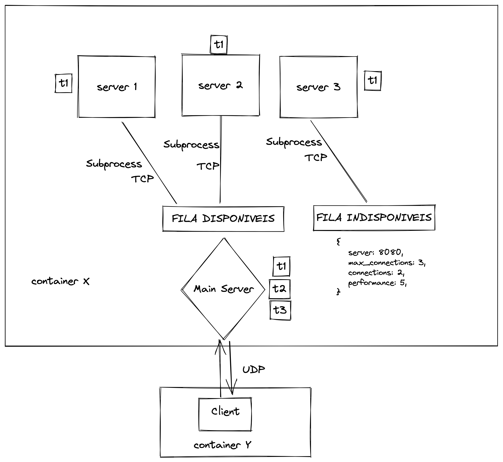

# superserver
Trabalho final da matéria de Sistemas Distribuídos

# Para executar o projeto:

    * 1 - Execute o comando: `docker network create network                                                 
    * 2 - Execute o comando: `docker-compose up --build`
